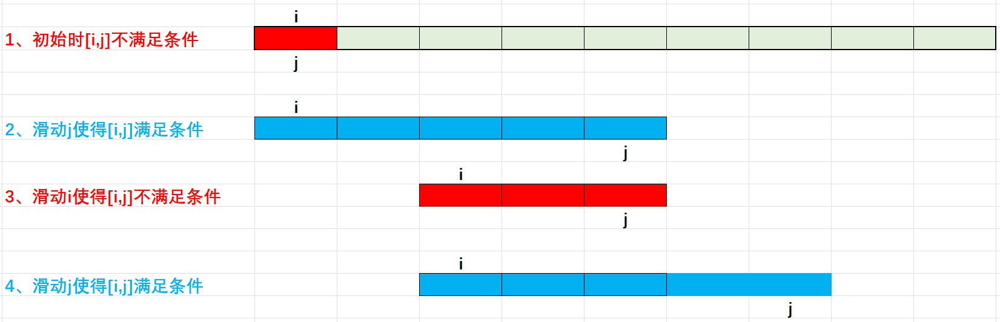

# 2.2 尺取法-滑动窗口和双指针

尺取法也叫双指针


## 1、尺取法核心概念

1.  单调性：这是尺取法的核心所在。也是尺取法能把算法从$O(n^2)$或者$O(n^3)$优化成$O(n)$的关键所在。需要在具体题目中深刻体会这一点才算彻底掌握这个算法。如果一道题可以用尺取法解决，那么需要先证明单调性。

2.  区间问题：尺取法主要解决序列的**区间**问题。

3.  尺取法概念：尺取法就是像尺子一样一段一段进行测量。尺取法使用一对下标表示所测量的区间的左右端点，根据测量结果不断地**单向**推进区间端点以找到答案。

4.  尺取法的2种扫描类型：

    两个指针$i$，$j$，有两种扫描方向：

    （1）、反向扫描：$i$，$j$，方向相反，$i$从头到尾，$j$从尾到头，在中间相遇。

    （2）、同向扫描：$i$，$j$方向相同，都是从头到尾，但是它们“速度”不同，可以让$j$跑在$i$前面。同向扫描也叫”快慢指针“，快慢指针在序列上产生一个大小可变的”滑动窗口“，因此也叫滑动窗口。

5.  常见套路

    （1）、固定右端点：快指针从左到右枚举区间右端点，滑动右端点时，保证区间$[i,j]$满足题目条件。然后滑动区间左端点$i$，直到区间$[i,j]$不满足条件。区间总是从不满足条件滑动快指针到满足条件，然后滑动慢指针从满足条件到不满足条件，而这个过程的保证就是单调性。

    （2）、固定左端点：快指针从右向左枚举区间左端点，其他的跟上面相反。


## 2、举例

题目链接：[Leetcode-209-长度最小的子数组](https://leetcode.cn/problems/minimum-size-subarray-sum/description/)

给定一个含有 `n`个**正整数**的数组和一个正整数 `target` **。**

找出该数组中满足其总和大于等于`target`的长度最小的 **连续子数组** `[numsl, numsl+1, ..., numsr-1, numsr]` ，并返回其长度**。**如果不存在符合条件的子数组，返回 `0` 。

**示例 1：**
```
**输入：**target = 7, nums = [2,3,1,2,4,3]
**输出：**2
**解释：**子数组 [4,3] 是该条件下的长度最小的子数组。
```

**示例 2：**
```
**输入：**target = 4, nums = [1,4,4]
**输出：**1
```

**示例 3：**
```
**输入：**target = 11, nums = [1,1,1,1,1,1,1,1]
**输出：**0
```

**提示：**
* `1 <= target <= 109`
* `1 <= nums.length <= 105`
* `1 <= nums[i] <= 105`


单调性分析：题目的核心关键词是很容易忽略的**正整数**，这是这题能用滑动窗口的关键。试着用数学归纳法证明（不完全是）。
采用常见套路，固定右端点，维护区间左闭右闭$[i,j]$，每次向右移动$j$直到区间从不满足条件到满足条件，然后移动慢指针$i$，使得区间从满足条件到不满足条件，这个过程记录答案。

（1）、当$i=j=0$时，显然不满足条件

（2）、因为每个元素都是正整数，滑动快指针$j$时，$[i,j]$区间的长度总是变大，只要没有滑动到结束位置，一定存在$j$使得区间的和大于等于target。

（3）、很关键的一步，滑动左指针。为什么左指针不需要重新从0开始呢？反证法，假设慢指针需要从0开始，因为现在区间$[i,j]$已经满足条件，那么对于任意的$0<=k<i,\sum a[k,j] >= target,a[k]>0$。所以$len[i,j]$一定小于$len[k,j]$。因此慢指针不需要从0开始枚举。另外慢指针在向快指针$j$移动的过程中，$\sum a[k,j],i<=k<=j$一定在逐步减少，因此肯定可以滑动指针$i$，使得$\sum[k,j]<target,i<=k<=j$不满足条件。这里条件$a[k] > 0$是单调性的前提条件，如果不满足单调性，无法使用滑动窗口算法。




采用左闭右开区间写法：$[i, j]$​

这个写法更像快排的partition，其实快排的partition也是双指针算法，它采用的是反向扫描

```c++
class Solution {
public:
    int minSubArrayLen(int target, vector<int>& nums) {
        int i = 0, j = 0, n = nums.size(), sum = 0, ans = INT_MAX;
        // 使用左闭右开写法，可以防止区间越界
        while (j < n) {
            while (j < n && sum < target) sum += nums[j++]; // 滑动快指针，直到区间满足条件
            while (i < j && sum >= target) { // 滑动慢指针，直到区间不满足条件
                ans = std::min(ans, j - i);
                sum -= nums[i++];
            }
        }
        return ans != INT_MAX ? ans : 0;
    }
};
```


采用左闭右闭区间写法：$[i,j]$

```c++
class Solution {
public:
    int minSubArrayLen(int target, vector<int>& nums) {
        int i = 0, j = 0, sum = 0, ans = INT_MAX;
        for (j = 0; j < nums.size(); ++j) {
            sum += nums[j]; // 向右滑动快指针，通过外层循环
            while (target <= sum) { // 向左滑动慢指针，通过内存循环
                ans = std::min(ans, j - i + 1);
                sum -= nums[i++];
            }
        }
        return ans != INT_MAX ? ans : 0;
    }
};
```


时间复杂度分析：只需要分析慢指针即可。慢指针从左滑动到右对每个元素都扫描一次，因此复杂度是$O(n)$


