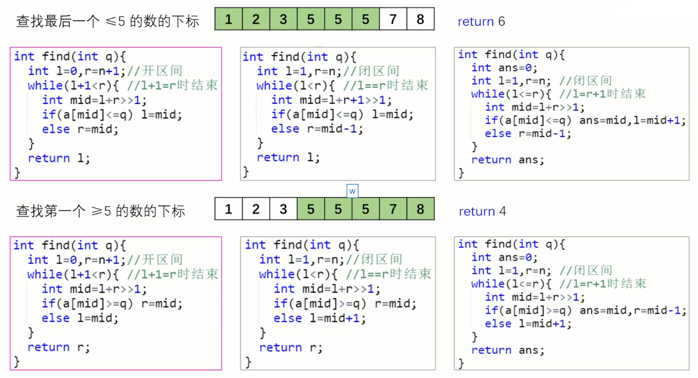
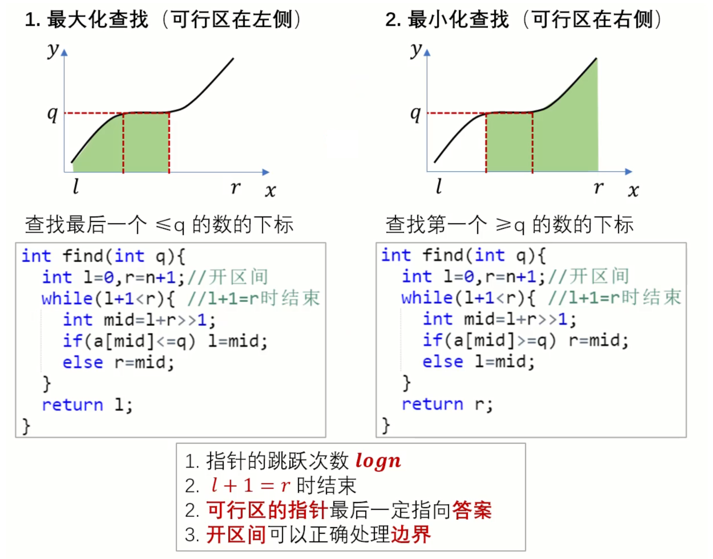
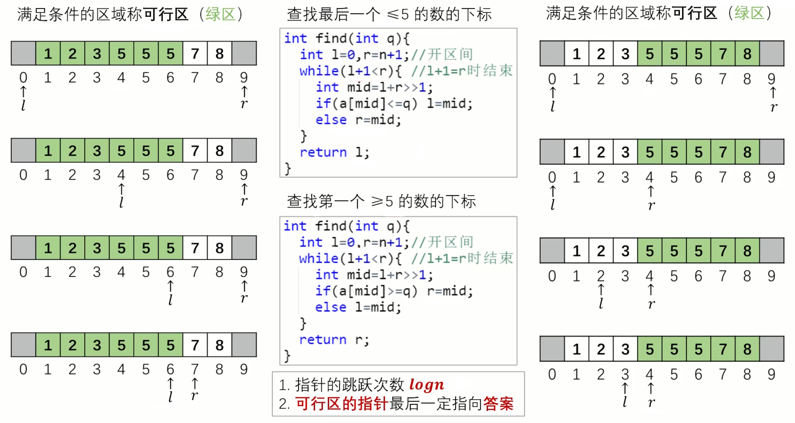

# 2.3 二分查找和二分答案

## 1、二分核心概念

要学好一个算法，首先要搞清楚与它相关的基本概念。

1.  二分的本质：优雅的暴力（枚举）。这个概念需要自己去体会。

2.  单调性：一般来说，能用二分查找或者二分答案算法解决的问题，会有单调性。

3.  二段性：针对二分答案来说的。所谓二段性就是二分答案左右两侧的性质完全相反。例如小于二分答案的区间都满足题目要求，大于二分答案的区间都不满足题目要求。二分答案就像一个分水岭，把问题分成性质不同的两段。只要能用二分答案解决的问题，一定具有二段性。但是不一定有单调性。不过，绝大部分的题目同时具有单调性。

4.  可行区：满足条件的区域叫可行区。例如，单调不下降数组$a[n]$, 如果条件是找出第一个大于等于$x$的位置$mid$，那么$[mid,n]$​就是可行区。

5.  单调递增序列中找$x$或$x$的**后继**定义如下：在单调递增数列$a[n]$中，如果有$x$，找到**第一个**$x$的位置，如果没有$x$，找比$x$大的第一个数的位置。简单来说就是找$a[mid] >=x$。

6.  单调递增序列中找$x$或$x$的**前驱**定义如下：在单调递增数列$a[n]$中，如果有$x$，找到**最后一个**$x$的位置，如果没有$x$，找比$x$小的第一个数的位置。简单来说就是找$a[mid] <=x$​。

## 2、二分查找

### 2.1、二分查找三个模版

### 2.2、区间左开右开的二分模版(l, r)

1.  特点是：在循环内部，不管是最大化查找还是最小化查找，都是一样的，而且不需要考虑mid是否加1，减1。
2.  易错点：区间是左开右开。如果数组有效区间是$[0, n - 1]$，那么对应的$l=-1,r=n$​
3.  答案一定在可行区。

### 2.3、举例

1.  灰色区是初始值。当可行区在左边的时候，$l$一直都指向可行区（绿色区）。$r$一直都指向不可行区（白色区）。所以答案返回值是$l$。
2.  灰色区是初始值。当可行区在右边的时候，$l$一直都指向不可行区（白色区）。$r$一直都指向可行区（绿色区）。所以答案返回值是$r$。

​    

